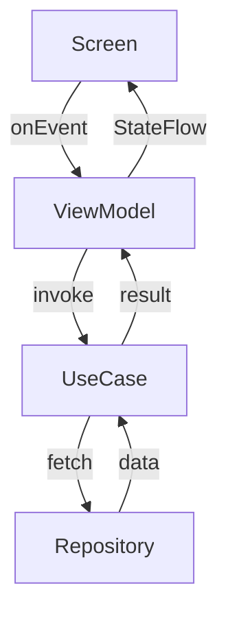
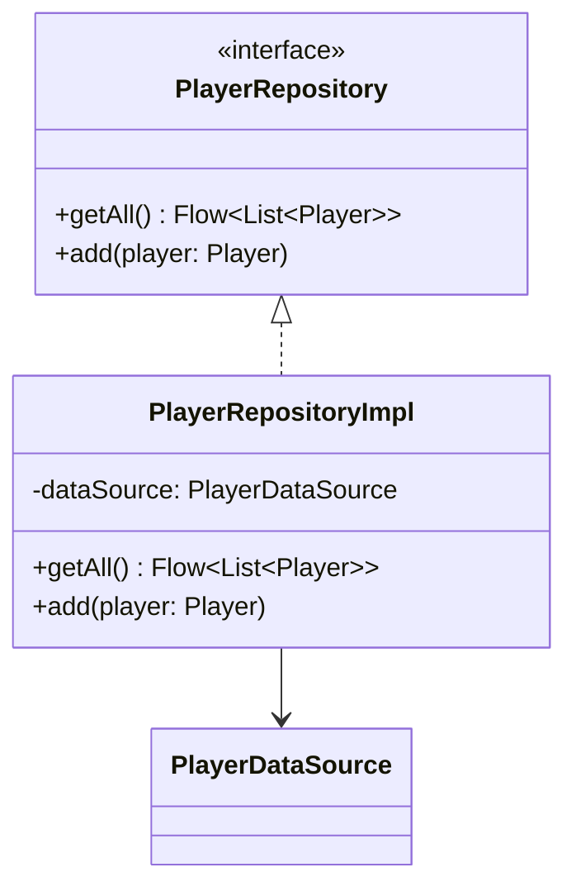
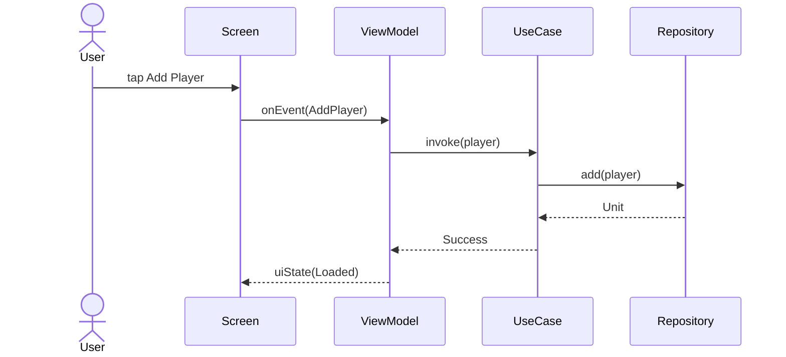
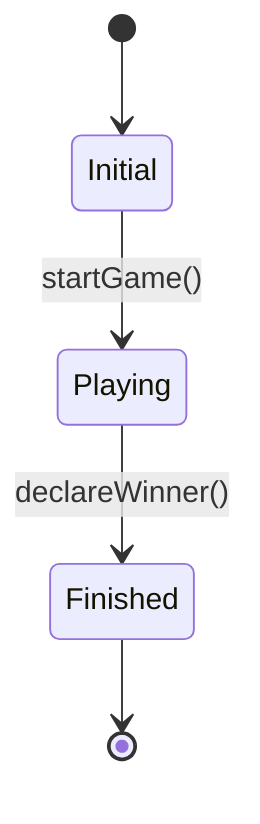
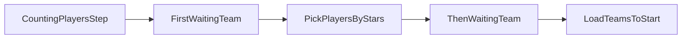

# Diagramas

## When to Use

- Creating or updating Mermaid diagrams in Markdown docs
- Designing UML class diagrams for a feature or pattern
- Creating sequence diagrams for user flows or API interactions
- Visualizing state machines or design pattern structures
- Documenting architecture in `docs/architecture/architecture-diagrams.md`
- Explaining a feature's data flow or component interaction

## Core Skills

- **Mermaid**: flowchart, classDiagram, sequenceDiagram, stateDiagram-v2, erDiagram
- **UML**: Class diagrams, Sequence diagrams, Activity diagrams
- **Architecture diagrams**: layered flowcharts, component relationships

## Mermaid Quick Reference

### Flowchart



### Class Diagram



### Sequence Diagram



### State Diagram



### Chain of Responsibility



## Procedure

1. **Choose diagram type** based on what you want to show:
   - Layers / flow → `flowchart`
   - Class structure + relationships → `classDiagram`
   - Time-based interactions → `sequenceDiagram`
   - State transitions → `stateDiagram-v2`
2. **Draft** the diagram in a Markdown code block with ` ```mermaid `
3. **Validate** rendering in VS Code Markdown Preview or mermaid.live
4. **Place** in the appropriate docs file (e.g., `docs/architecture/architecture-diagrams.md`)

## Documentation Placement

| Diagram Type                  | Location                                                           |
| ----------------------------- | ------------------------------------------------------------------ |
| Global architecture flowchart | `docs/architecture/architecture-diagrams.md` → Section 1           |
| Feature class diagram         | `docs/architecture/architecture-diagrams.md` → Section per feature |
| Feature sequence diagram      | `docs/architecture/architecture-diagrams.md` → Section per feature |
| Design pattern diagram        | `docs/architecture/architecture-diagrams.md` → Section 3, 4, 5     |

## Anti-patterns to Flag

- Diagrams that show too many levels of detail (unreadable)
- Class diagrams without relationships (just boxes)
- Sequence diagrams without return messages (incomplete flow)
- Outdated diagrams that contradict the current code
- Missing labels on arrows
