# ARQUITETURA

Este documento descreve a arquitetura do projeto e como ele está estruturado.

## Visão Geral

O projeto segue o padrão **Clean Architecture** e está organizado para garantir alta modularidade, separação de responsabilidades e facilidade de manutenção.

### Estrutura Principal

- **/lib**: Contém o código principal da aplicação que será executada. Segue o padrão Clean Architecture, com as seguintes camadas:
  - `app/`: Inicialização do app, rotas, temas e configuração geral.
  - `core/`: Utilitários, helpers e serviços globais.
  - `data/`: Fontes de dados, repositórios e implementações de acesso a dados.
  - `domain/`: Entidades, casos de uso e contratos de negócio.
  - `infra/`: Integrações externas e implementações de infraestrutura.
  - `presentation/`: Widgets, páginas, lógica de apresentação e gerenciamento de estado.
  - `translations/`: Internacionalização e arquivos de tradução.

- **/packages**: Contém módulos internos reutilizáveis, chamados de "features". Cada módulo pode ser utilizado pela aplicação conforme necessário. Os seguintes módulos são obrigatórios:
  - `core`: Funcionalidades e utilitários essenciais compartilhados.
  - `clean_code_data`: Implementações de acesso a dados seguindo o padrão clean code.
  - `clean_code_domain`: Entidades e regras de negócio reutilizáveis.
  - `clean_code_infra`: Integrações e serviços de infraestrutura reutilizáveis.

Outros módulos podem ser adicionados em `/packages` para funcionalidades específicas, como `analytics`, `admin`, etc.

## Padrão Clean Architecture

A Clean Architecture propõe a separação do código em camadas, onde cada camada tem uma responsabilidade clara e depende apenas de camadas mais internas. Isso facilita testes, manutenção e evolução do projeto.

- **Domain**: Regras de negócio puras, independentes de frameworks e detalhes de implementação.
- **Data**: Implementação dos contratos definidos em domain, acesso a bancos, APIs, etc.
- **Infra**: Integrações externas, como serviços de terceiros.
- **Presentation**: Interface com o usuário, widgets, páginas e lógica de apresentação.

## Modularização

- Cada módulo em `/packages` pode ser desenvolvido, testado e versionado de forma independente.
- A aplicação principal em `/lib` consome esses módulos conforme necessário, garantindo reuso e isolamento de responsabilidades.

## Convenções

- Internacionalização centralizada em `lib/translations/`.
- Rotas e middlewares definidos em `lib/app/app.dart`.
- Gerenciamento de estado flexível, podendo variar por módulo (bloc, cubit, provider, etc).
- Regras de lint customizadas em `analysis_options.yaml`.

## Exemplos

- Para adicionar uma nova feature, crie um pacote em `/packages` seguindo a separação por camadas.
- Para adicionar uma nova tela, crie um widget em `lib/presentation/` e registre a rota em `lib/app/app.dart`.
- Para adicionar uma nova tradução, edite os arquivos em `lib/translations/`.

---

Para mais detalhes, consulte o README.md ou os exemplos de pacotes em `/packages`.

Este diagrama ilustra a arquitetura em camadas do projeto Flutter monorepo, incluindo os pacotes da pasta /packages e suas dependências principais.

```mermaid
graph TD
  %% Core and foundational packages
  core[core]
  design_system[design_system]
  dependency[dependency]

  %% Higher-level architectural domains
  domain[clean_code_domain]
  data[clean_code_data]
  infra[clean_code_infra]

  %% Packages (UI/Features) in /packages
  admin[admin]
  analytics[analytics]
  appsflyer[appsflyer]
  webapp[web_app]
  webview[web_view]
  user_account[user_account]
  splash[splash]
  settings[settings]
  security[security]
  faq[faq]
  feature_flag[feature_flag]
  firebase_initialize[firebase_initialize]
  force_update[force_update]
  home[home]
  login[login]
  onboarding[onboarding]
  notifications[notifications]
  push_notifications[push_notifications]
  push_messaging[push_messaging]
  deeplink[deeplink]
  crashlytics[crashlytics]

  %% Core and foundational relationships
  core --> domain
  core --> data
  core --> infra
  core --> dependency
  core --> design_system

  %% Design system and DI
  design_system --> core
  design_system --> dependency

  %% Internal package interactions (some are interdependent)
  clean_code_data --> core
  clean_code_data --> dependency
  clean_code_data --> domain
  clean_code_infra --> core
  clean_code_infra --> dependency
  clean_code_infra --> data
  firebase_initialize --> core
  firebase_initialize --> dependency
  crashlytics --> core
  crashlytics --> dependency
  appsflyer --> core
  appsflyer --> dependency
  analytics --> core
  analytics --> dependency
  deeplink --> core
  deeplink --> dependency
  force_update --> core
  force_update --> dependency
  feature_flag --> core
  feature_flag --> dependency
  onboarding --> core
  onboarding --> dependency
  home --> core
  home --> dependency
  login --> core
  login --> dependency
  notifications --> core
  notifications --> dependency
  push_notifications --> core
  push_notifications --> dependency
  push_messaging --> core
  push_messaging --> dependency
  push_messaging --> firebase_initialize
  push_messaging --> analytics
  push_messaging --> crashlytics
  push_messaging --> push_notifications
  security --> core
  security --> dependency
  settings --> core
  settings --> dependency
  settings --> user_account
  splash --> core
  splash --> dependency
  user_account --> core
  user_account --> dependency
  webapp --> core
  webapp --> dependency
  webview --> core
  webview --> dependency

  admin --> core
  admin --> dependency

  %% Optional: show all nodes on a single diagram for clarity
  classDef package fill:#f9f,stroke:#333,stroke-width:1px;
  class admin,analytics,appsflyer,webapp,webview,user_account,splash,settings,security,faq,feature_flag,firebase_initialize,force_update,home,login,onboarding,notifications,push_notifications,push_messaging,deeplink,crashlytics,core,dependency,design_system,data,infra package;
```

