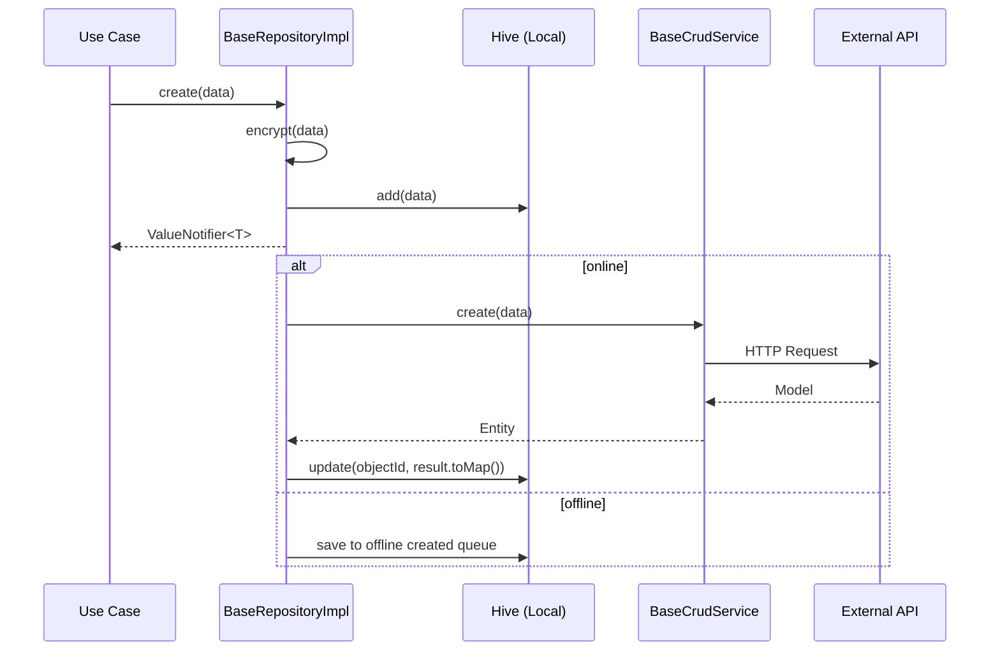

# Data Repositories

Propósito
- Descrever implementações de repositórios, contratos, e mapeamentos entre domain e infra.

## Visão Geral

Repositórios no `clean_code_data` implementam os contratos definidos em `clean_code_domain`. Eles coordenam o acesso a fontes de dados (APIs, banco local, cache) e retornam resultados para os use cases.

## Padrão de Nomenclatura

| Tipo | Padrão | Exemplo |
|------|--------|---------|
| Repository (domain) | Sufixo `Repository` | `BaseRepository<T>` |
| Repository (data) | Sufixo `Impl` | `BaseRepositoryImpl<T>` |

## Hierarquia

```
BaseRepository<T> (domain - interface abstrata)
  └── BaseRepositoryImpl<T extends BaseEntity> (data - implementação offline-first)
        ├── BaseCrudService<T> (domain - serviço CRUD)
        ├── CheckInternetConnectionUseCase (domain)
        ├── LocalStorageUseCase (domain)
        └── OfflineFirstLocalDatabase<Map<String, dynamic>> (infra - banco Hive)
```

## Contrato (domain)

```dart
abstract class BaseRepository<T> {
  ValueNotifier<List<ValueNotifier<T>>> get valueListenable;

  Future<void> initLocalDatabase();
  Future<void> dispose();
  Future<T> create(Map<String, dynamic> data);
  Future<T> read(String objectId);
  Future<T> update(String objectId, {required Map<String, dynamic> data});
  Future<void> delete(String objectId);
  Future<void> deleteLocalDatabase();
  Future<void> fetch();
  int Function(T a, T b)? get sort;
  Future<T> encrypt(T item);
  Future<T> decrypt(T item);
}
```

## Estratégia Offline-First

O `BaseRepositoryImpl` implementa uma estratégia offline-first completa:

1. **Criação**: salva localmente no Hive e, se houver internet, sincroniza com o servidor em background
2. **Atualização**: atualiza localmente e agenda sincronização remota
3. **Exclusão**: remove localmente e agenda exclusão remota
4. **Leitura**: busca do banco local, com fallback para dados remotos via `fetch()`
5. **Sincronização**: filas separadas para itens criados, atualizados e deletados offline
6. **Reatividade**: expõe `ValueNotifier<List<ValueNotifier<T>>>` para reatividade na UI

## Fluxo de Dados



## Exemplo de Uso

```dart
final repository = AppBinding.find<BaseRepository<UserEntity>>();

// Inicializar banco local
await repository.initLocalDatabase();

// Buscar dados (local + remoto)
await repository.fetch();

// Observar lista reativa
repository.valueListenable.addListener(() {
  final items = repository.valueListenable.value;
  for (final item in items) {
    print('Item: ${item.value.objectId}');
  }
});

// Criar
final created = await repository.create({'name': 'Novo Item'});

// Atualizar
await repository.update(objectId, data: {'name': 'Atualizado'});

// Deletar
await repository.delete(objectId);
```

## Registro na Binding

```dart
AppBinding.put<BaseRepository<UserEntity>>(
  BaseRepositoryImpl<UserEntity>(
    localDatabaseName: 'users',
    service: AppBinding.find<BaseCrudService<UserEntity>>(),
    checkInternetUseCase: AppBinding.find<CheckInternetConnectionUseCase>(),
    localStorageUseCase: AppBinding.find<LocalStorageUseCase>(),
    localDatabase: AppBinding.find<OfflineFirstLocalDatabase<Map<String, dynamic>>>(),
  ),
);
```

## Tratamento de Erros

O `BaseRepositoryImpl` captura exceções durante operações offline e remote, registra via `Log` e propaga `BaseException` quando necessário. Operações offline são enfileiradas e reexecutadas quando a conexão é restabelecida.

## Checklist para Criar um Novo Repository

- [ ] Contrato definido em `clean_code_domain` como interface `BaseRepository<T>`
- [ ] Implementação em `clean_code_data` com sufixo `Impl`
- [ ] Usa `BaseCrudService` para operações remotas
- [ ] Usa `OfflineFirstLocalDatabase` para persistência local
- [ ] Estratégia offline-first implementada
- [ ] `ValueNotifier` para reatividade
- [ ] Registrado via `AppBinding.put()`
- [ ] Testes unitários com mock de dependências

---

**Ver também**: [Models](models.md) | [Domain](../domain/README.md) | [Infra](../infra/infra.md)
