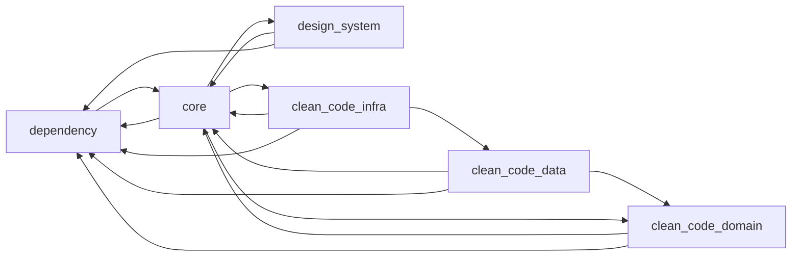

# Documentação da Estrutura do Projeto

## Visão Geral doWorkspace

Este projeto utiliza uma estrutura de monorepo com Flutter Workspace, contendo o app principal e 28 pacotes compartilhados.

## Estrutura principal `/lib`

```mermaid
graph TD
    root[lib/] --> app
    root --> core
    root --> data
    root --> domain
    root --> infra
    root --> presentation
    root --> translations

    app --> themes[app/themes/]

    core --> push_messaging[core/push_messaging/]
    core --> callbacks[core/push_messaging/callbacks/]

    data --> data_sources[data/data_sources/]
    data --> models[data/models/]
    data --> repositories[data/repositories/]
    data --> services[data/services/]
    data --> use_cases[data/use_cases/]

    domain --> constants[domain/constants/]
    domain --> enums[domain/enums/]
    domain --> entities[domain/entities/]
    domain --> repositories_d[domain/repositories/]
    domain --> services_d[domain/services/]
    domain --> use_cases_d[domain/use_cases/]

    infra --> http[infra/http/]
    infra --> data_sources_infra[infra/data_sources/]

    http --> interceptors[infra/http/interceptors/]

    presentation --> check_points[presentation/check_points/]
    presentation --> check_point[presentation/check_point/]

    check_points --> widgets1[presentation/check_points/widgets/]
    check_point --> widgets2[presentation/check_point/widgets/]
```



## Estrutura dos Pacotes `/packages`

```mermaid
graph TD
    workspace[Workspace Packages] --> core
    workspace --> dependency
    workspace --> design_system

    workspace --> clean
    clean --> clean_code_data
    clean --> clean_code_domain
    clean --> clean_code_infra

    workspace --> infra
    infra --> analytics
    infra --> appsflyer
    infra --> crashlytics
    infra --> deeplink
    infra --> firebase_initialize
    infra --> feature_flag

    workspace --> notifications
    notifications --> notifications
    notifications --> push_notifications
    notifications --> push_messaging

    workspace --> features
    features --> splash
    features --> onboarding
    features --> force_update
    features --> security
    features --> login
    features --> admin
    features --> home
    features --> settings
    features --> faq
    features --> user_account
    features --> web_app
    features --> webview
```



## Estrutura Detalhada por Pacote

### Pacotes de Infraestrutura

| Pacote              | Descrição               | Estrutura Principal                                                                       |
| ------------------- | ----------------------- | ----------------------------------------------------------------------------------------- |
| `core`              | Núcleo compartilhado    | crashlytics, logger, native, security, push_messaging, constants, platform, middlewares   |
| `dependency`        | Injeção de dependências | http, storage, database, security, analytics, notifications, permissions, camera, widgets |
| `design_system`     | Componentes UI          | components (molecules: buttons, progress_bar, skeleton, inputs, etc.)                     |
| `clean_code_data`   | Camada de dados         | database, local_storage, http (interceptors), models, repositories                        |
| `clean_code_domain` | Camada de domínio       | dto, enums, repositories, use_cases                                                       |
| `clean_code_infra`  | Infraestrutura          | database (hive), local_storage, http, data_sources                                        |

### Pacotes de Serviços

| Pacote                | Descrição                             |
| --------------------- | ------------------------------------- |
| `analytics`           | Integração Aptabase                   |
| `appsflyer`           | Tracking de instalações               |
| `crashlytics`         | Integração Sentry                     |
| `deeplink`            | Links profundo                        |
| `firebase_initialize` | Inicialização Firebase                |
| `feature_flag`        | Feature Flags (Flagsmith, GrowthBook) |

### Pacotes de Notificações

| Pacote               | Descrição               |
| -------------------- | ----------------------- |
| `notifications`      | Lista de notificações   |
| `push_notifications` | Push notifications      |
| `push_messaging`     | Gerenciamento de topics |

### Pacotes de Funcionalidades

| Pacote         | Descrição               | Páginas                                |
| -------------- | ----------------------- | -------------------------------------- |
| `splash`       | Tela de abertura        | splash                                 |
| `onboarding`   | Tutorial inicial        | intro (intro_page, page_views)         |
| `force_update` | Atualização obrigatória | blocking, update                       |
| `security`     | Autenticação biométrica | security_page, security_blocked        |
| `login`        | Autenticação            | login, signup                          |
| `admin`        | Painel administrativo   | web_visit_history, create_notification |
| `home`         | Home principal          | home                                   |
| `settings`     | Configurações           | settings, themes                       |
| `faq`          | FAQ e Feedback          | about, feedback                        |
| `user_account` | Gerenciamento de conta  | user, change_password, delete_account  |
| `web_app`      | Apps externos           | web                                    |
| `webview`      | WebView                 | webview                                |

## Camadas Clean Code

Cada pacote segue uma estrutura de Clean Architecture:

```
src/
├── data/
│   ├── data_sources/
│   ├── repositories/
│   ├── services/
│   └── use_cases/
├── domain/
│   ├── entities/
│   ├── repositories/
│   ├── services/
│   └── use_cases/
├── infra/
│   └── data_sources/
└── presentation/
    └── [feature]/
        ├── bindings/
        ├── controller/
        ├── page/
        └── widgets/
```

## Dependências entre Pacotes



## Resumo

- **Total de pacotes**: 28 + app principal
- **Estrutura**: Workspace Flutter com monorepo
- **Arquitetura**: Clean Architecture (data, domain, infra, presentation)
- **Pattern**: GetX para gerenciamentode estado e rotas
