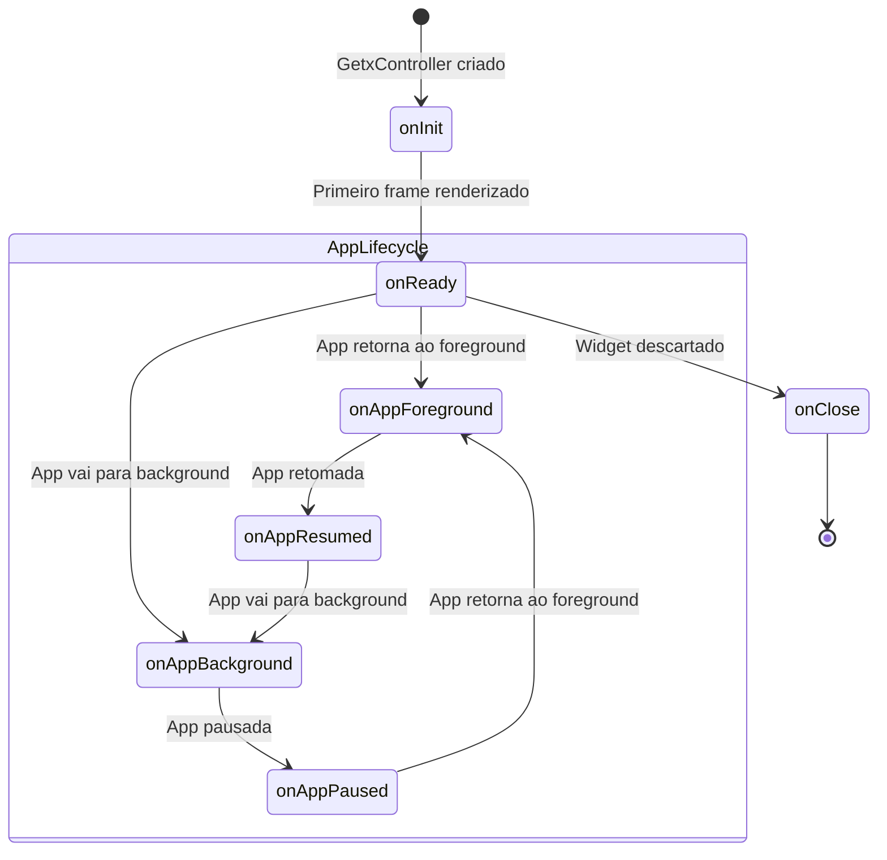

# Presentation Controllers

## Visão Geral

Controllers no Flutter Demo App usam **GetX** com `BaseController` ou `LifecycleController` para gerenciar estado, dependências e ciclo de vida da UI. Eles orquestram a comunicação entre a presentation e as camadas domain/data.

## Hierarquia de Classes

```
GetxController (GetX)
  └── AnalyticsMixin (core)
        └── BaseController (core)
              ├── setPageContext(BuildContext)
              ├── setOrientationPortraitOnly / LandscapeOnly / Rotate
              ├── openNotifications()
              ├── backPage({result})
              ├── screenTagging / clickTagging / backTagging / callbackTagging
              │
              └── LifecycleController (core) — implements LifecycleApp, WidgetsBindingObserver
                    ├── appInBackground / appInForeground
                    ├── refreshUnCountNotifications()
                    ├── onAppForeground()
                    ├── onAppResumed()
                    ├── onAppPaused()
                    ├── onAppBackground()
                    └── onAppTerminate()
```

## Quando Usar Cada Classe

| Classe                | Quando usar                                                                         |
| --------------------- | ----------------------------------------------------------------------------------- |
| `BaseController`      | Telas simples sem necessidade de hooks de ciclo de vida do app                      |
| `LifecycleController` | Telas que precisam reagir a pausa/retomada do app (ex: webview, biometria, streams) |

## Padrão de Nomenclatura

| Tipo       | Padrão              | Exemplo                                |
| ---------- | ------------------- | -------------------------------------- |
| Controller | Sufixo `Controller` | `HomeController`, `SecurityController` |

## Dependências

- `package:dependency/dependency.dart` — GetX (Get, GetxController, Rx, Obx)
- `package:core/core.dart` — BaseController, LifecycleController, LifecycleApp
- `package:design_system/design_system.dart` — AppView

## Exemplo Completo

### Controller com Lifecycle Hooks

```dart
import 'package:dependency/dependency.dart';
import 'package:core/core.dart';

class SecurityController extends LifecycleController {
  final LocalStorageUseCase _localStorageUseCase;
  final CheckBiometricsUseCase _checkBiometricsUseCase;
  final AuthenticateBiometricUseCase _authenticateBiometricUseCase;
  final LogoutUseCase _logoutUseCase;
  final AppSecurityManager _appSecurityManager;

  SecurityController({
    required LocalStorageUseCase localStorageUseCase,
    required CheckBiometricsUseCase checkBiometricsUseCase,
    required AuthenticateBiometricUseCase authenticateBiometricUseCase,
    required LogoutUseCase logoutUseCase,
    required AppSecurityManager appSecurityManager,
  })  : _localStorageUseCase = localStorageUseCase,
        _checkBiometricsUseCase = checkBiometricsUseCase,
        _authenticateBiometricUseCase = authenticateBiometricUseCase,
        _logoutUseCase = logoutUseCase,
        _appSecurityManager = appSecurityManager;

  final RxBool isLoading = RxBool(true);
  final RxBool hasSupportedBiometrics = RxBool(false);
  final RxBool biometric = RxBool(false);

  @override
  void onReady() {
    super.onReady();
    _checkDeviceSupportedBiometrics();
    biometric.value = _appSecurityManager.biometricsEnabled;
    if (appInForeground) _asyncUnlockApp();
  }

  @override
  void onAppForeground() {
    super.onAppForeground();
    _asyncUnlockApp();
  }

  @override
  void onClose() {
    isLoading.close();
    hasSupportedBiometrics.close();
    biometric.close();
    super.onClose();
  }

  Future<void> toggleBiometric(bool value) async {
    biometric.value = value;
    await _appSecurityManager.setBiometricsEnabled(value);
    if (value) await authenticateBiometric();
  }

  Future<void> authenticateBiometric() async {
    final authenticated = await _authenticateBiometricUseCase.call();
    if (!authenticated) biometric.value = false;
  }

  Future<void> logout() async {
    await _logoutUseCase.call();
  }
}
```

### Controller Simples (sem Lifecycle)

```dart
import 'package:dependency/dependency.dart';
import 'package:core/core.dart';

class SplashController extends BaseController {
  SplashController({required ...});

  @override
  void onInit() {
    super.onInit();
    BaseController.SPLASH_ALREADY_EXECUTED = true;
  }

  @override
  void onReady() {
    super.onReady();
    // iniciar lógica assíncrona de inicialização
  }
}
```

## Estado Reativo

| Tipo                                       | Uso                                                                                    |
| ------------------------------------------ | -------------------------------------------------------------------------------------- |
| `RxBool`, `RxInt`, `RxString`, `RxList<T>` | Estado que atualiza a UI via `Obx`                                                     |
| `ValueNotifier<T>` / `ValueListenable<T>`  | Estado de alta frequência (ex: loading de webview) para evitar rebuilds desnecessários |

```dart
final _isLoading = RxBool(false);
bool get isLoading => _isLoading.value;

final errorMessage = RxString('');
final ValueNotifier<bool> hasError = ValueNotifier(false);
```

## Ciclo de Vida



## Ciclo de Vida do App (LifecycleController)

| Hook                | Disparo                          | Uso comum                              |
| ------------------- | -------------------------------- | -------------------------------------- |
| `onAppForeground()` | App retorna ao primeiro plano    | Recarregar dados, reautenticar         |
| `onAppResumed()`    | App está ativa e interagindo     | Retomar streams, subscriptions         |
| `onAppPaused()`     | App perde foco (ex: notificação) | Salvar estado, pausar streams          |
| `onAppBackground()` | App vai para background          | Pausar webview, salvar scroll position |
| `onAppTerminate()`  | App está sendo encerrada         | Limpeza final                          |

## Boas Práticas

1. **Dependências via construtor**: Injetar use cases e serviços como `required` named parameters
2. **Estado reativo**: Usar `Rx` types para estado que atualiza a UI
3. **Performance**: Usar `ValueNotifier` para atualizações de alta frequência
4. **Limpeza em onClose**: Fechar todos os Rx vars com `.close()`, cancelar subscriptions, chamar `super.onClose()`
5. **Lógica no controller**: Nunca na Page — Pages devem ser declarativas
6. **Um controller por feature**: Evitar controllers genéricos
7. **Analytics**: Usar `clickTagging()`, `screenTagging()` do `AnalyticsMixin`

## Checklist para Criar um Novo Controller

- [ ] Nome segue padrão `NomeFeatureController`
- [ ] Estende `LifecycleController` (se precisa de lifecycle hooks) ou `BaseController`
- [ ] Dependências injetadas via construtor (`required` named params)
- [ ] Estado reativo com `Rx` types ou `ValueNotifier`
- [ ] Implementa `onInit`, `onReady`, `onClose` quando necessário
- [ ] Implementa hooks de lifecycle app quando necessário
- [ ] Todos os Rx vars fechados em `onClose`
- [ ] Stream subscriptions canceladas em `onClose`
- [ ] Registrado na Binding correspondente
- [ ] Testes unitários com mock de dependências

---

**Veja também**: [Page](pages.md) | [Bindings](bindings.md) | [Design System](../design-system/README.md) | [Domain](../domain/README.md)
