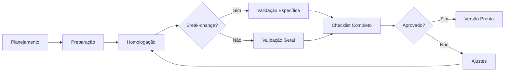

# Homologação de Versão

Propósito
- Definir o processo de homologação para garantir que cada versão do App seja estável, testada e validada antes de ser disponibilizada.

## Visão Geral



## Etapas

### 1. Planejamento

- Definir escopo da versão (features, fixes, atualizações)
- Identificar break-changes antecipadamente:
  - Atualização de versão do Flutter ou Dart SDK
  - Atualização de libs principais (firebase, messaging, analytics, crashlytics, etc.)
  - Mudanças de contrato em APIs externas
  - Alterações em serviços de terceiros
- Criar checklist de funcionalidades afetadas por cada break-change

### 2. Preparação

- Criar branch de release a partir de `developments/master`
- Bump de versão no `pubspec.yaml` (seguir semver)
- Atualizar `CHANGELOG.md`

### 3. Homologação

#### 3.1. Verificações Automatizadas

```bash
make analyze   # sem erros
make test      # 100% passando
```

#### 3.2. Validação de Break-changes

Toda atualização de lib ou do Flutter deve ser tratada como **break-change potencial** e requer validação específica para cada funcionalidade associada.

| Atualização | Funcionalidades a Validar |
|-------------|--------------------------|
| `firebase_core` / `firebase_messaging` | Push notifications (todos os cenários), FCM token, foreground/background/killed |
| `sentry_*` | Crash reporting, breadcrumbs, performance tracking |
| `aptabase` | Analytics events, session tracking |
| Flutter SDK | Build em todas as plataformas, navegação, rendering, plataformas nativas |
| `dart` SDK | Compilação, type system, análise estática |
| `http` / `dio` | Todas as chamadas de API, tratamento de erros, timeouts |
| Pacotes de cache local | Leitura/escrita de dados offline, migração de schema |
| `build_runner` / code-gen | Geração de código, build |

**Exemplo — Firebase Messaging:**

```markdown
- [ ] Push em foreground (notification data-only)
- [ ] Push em background (iOS/Android)
- [ ] Push com App killed (iOS/Android)
- [ ] Recebimento de FCM token (novo/refresh)
- [ ] Navegação ao tocar na notificação (deep link)
- [ ] Notificações silenciosas (data-only)
- [ ] Permissão de notificações (primeiro acesso, negado, revogado)
- [ ] Grupo de notificações (Android)
```

#### 3.3. Matriz de Cenários

Para cada break-change, criar uma matriz de validação cruzando:

```
Funcionalidade × Plataforma × Estado do App × Ambiente
```

| Funcionalidade | Android | iOS | Web | macOS |
|---------------|---------|-----|-----|-------|
| Push notification | ✅ | ✅ | N/A | N/A |
| Login | ✅ | ✅ | ✅ | ✅ |
| Offline cache | ✅ | ✅ | ✅ | ✅ |

Onde `✅` significa que o cenário foi testado e aprovado.

#### 3.4. Checklist de Funcionalidades

Checklist padrão que deve ser executado **integralmente** em toda homologação:

```markdown
### Autenticação
- [ ] Login com credenciais válidas
- [ ] Login com credenciais inválidas (exibe erro)
- [ ] Logout
- [ ] Refresh token / sessão expirada
- [ ] Biometria (se aplicável)

### Navegação
- [ ] Deep links funcionando
- [ ] Voltar (Android) / Swipe back (iOS)
- [ ] Bottom navigation / tabs
- [ ] Rotas protegidas (redireciona se não autenticado)

### Dados
- [ ] Listagem com dados do servidor
- [ ] Pull-to-refresh
- [ ] Paginação / infinite scroll
- [ ] Estado vazio (empty state)
- [ ] Estado de erro (falha de rede)
- [ ] Estado de loading (skeleton / spinner)
- [ ] Cache offline funcionando
- [ ] Sincronização ao voltar online

### Push Notifications
- [ ] App em foreground
- [ ] App em background
- [ ] App killed
- [ ] Deep link ao tocar na notificação
- [ ] Notificação silenciosa (data-only)

### Analytics & Crashlytics
- [ ] Eventos de analytics sendo enviados (Aptabase)
- [ ] Crash report enviado ao Sentry em cenário de erro forçado
- [ ] Breadcrumbs registrados

### UI/UX
- [ ] Temas (light/dark) consistentes
- [ ] Fontes e ícones carregados corretamente
- [ ] Responsividade (diferentes tamanhos de tela)
- [ ] Acessibilidade (VoiceOver / TalkBack)

### Performance
- [ ] Build release sem warnings
- [ ] Tempo de inicialização aceitável
- [ ] Consumo de memória sem vazamentos
- [ ] Scroll suave (sem jank)

### Plataforma (específico por plataforma)
- [ ] Build Android (APK / AAB)
- [ ] Build iOS (Archive)
- [ ] Build Web
- [ ] Build macOS
```

### 4. Registro de Homologação

Cada homologação deve gerar um registro contendo:

- **Versão**: `x.y.z`
- **Data**: `YYYY-MM-DD`
- **Escopo**: lista de mudanças desde a última versão
- **Break-changes identificados**: quais libs/sdks foram atualizados
- **Checklist preenchido**: itens testados com resultado
- **Problemas encontrados**: bugs ou regressões abertos durante a homologação
- **Aprovadores**: responsáveis pela validação

### 5. Critérios de Aceite

Uma versão é considerada **pronta e estável** quando:

- [ ] `make analyze` — 0 erros, 0 warnings
- [ ] `make test` — 100% dos testes passando
- [ ] Break-changes validados com matriz de cenários completa
- [ ] Checklist de funcionalidades 100% preenchido e aprovado
- [ ] Nenhum bug crítico ou blocker em aberto
- [ ] CHANGELOG atualizado
- [ ] Versão bumpada no `pubspec.yaml`
- [ ] Build release bem-sucedido em todas as plataformas alvo
- [ ] Aprovado pelo time de qualidade / tech lead

---

**Ver também**: [CI/CD](../ci-cd/README.md) | [Testes](../testing/README.md) | [Governança](../governance.md)
