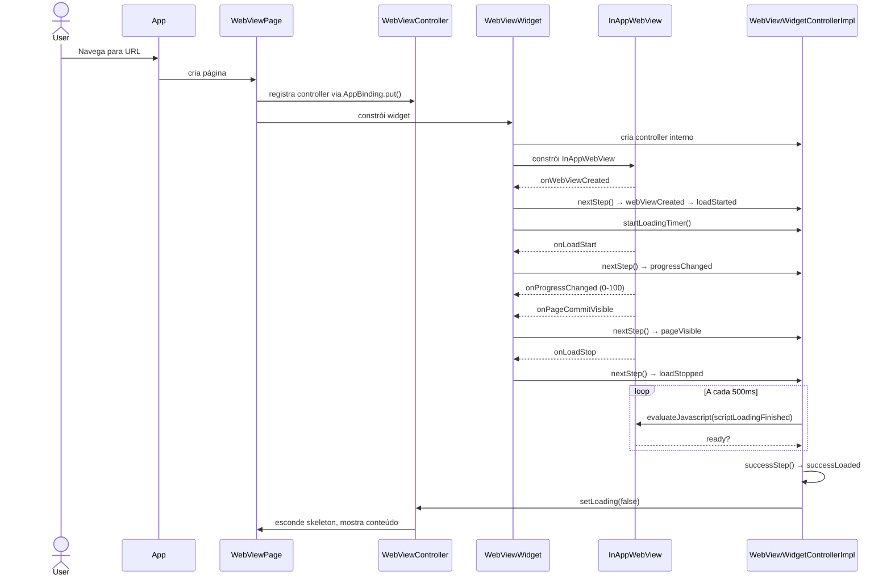

# Módulo WebView

## Visão Geral

Pacote Flutter que provê integração completa de WebView para o ecossistema UOL, construído sobre `flutter_inappwebview`. Implementa Clean Architecture com 3 camadas e utiliza `GetX LifecycleController` para gerenciamento de estado.

## Arquitetura

### Padrão: Clean Architecture + Mixins

```
Domain (entities, enums, interfaces)
    ↕
Data (implementações concretas, JavaScript constants)
    ↕
Presentation (widgets, controllers, mixins)
```

### Camadas

| Camada | Diretório | Propósito |
|---|---|---|
| **Domain** | `src/domain/` | Entidades de negócio, interfaces abstratas, enums (sem dependência Flutter) |
| **Data** | `src/data/` | Implementações concretas, constantes JavaScript para injeção |
| **Presentation** | `src/presentation/` | Widgets Flutter, controllers, StatefulWidgets, mixins |

### Estrutura de Arquivos

```
lib/
├── webview.dart                          # Entrypoint público (2 exports)
└── src/
    ├── module_bindings.dart              # WebViewModuleBindings
    ├── module_routes.dart                # WebViewModuleRoutes
    ├── domain/
    │   ├── domain.dart                   # Barrel export
    │   ├── callbacks/
    │   │   └── custom_navigator_callback.dart  # CustomNavigatorCallback (abstract)
    │   ├── entities/
    │   │   └── reload_expired_url_entity.dart  # ReloadExpiredUrlEntity
    │   └── enums/
    │       └── load_webview_step_enum.dart      # LoadWebviewStepEnum
    ├── data/
    │   ├── data.dart                     # Barrel export
    │   ├── callbacks/
    │   │   └── custom_navigator_callback.dart  # CustomNavigatorCallbackImpl
    │   └── javascripts/
    │       ├── webview_dark_mode.dart           # scriptDarkMode (CSS)
    │       └── webview_loading_finished.dart    # scriptLoadingFinished (JS)
    └── presentation/
        ├── presentation.dart             # Barrel export
        ├── webview/
        │   ├── webview_page.dart         # WebViewPage (StatefulWidget)
        │   ├── webview_controller.dart   # WebViewController
        │   ├── webview_bindings.dart     # WebViewBindings
        │   └── widgets/
        │       ├── webview_widget.dart           # WebViewWidget (StatefulWidget)
        │       ├── webview_widget_controller.dart # WebViewWidgetController (abstract + impl)
        │       └── webview_headless.dart         # WebViewHeadless
        └── mixins/
            ├── load_callbacks_mixin.dart       # LoadCallbacksMixin
            ├── navigator_callbacks_mixin.dart  # NavigatorCallbacksMixin
            └── error_callbacks_mixin.dart      # ErrorCallbacksMixin
```

## Diagrama de Classes

```mermaid
classDiagram
    class ModuleRoutes {
        <<interface>>
    }
    class ModuleBinding {
        <<interface>>
    }
    class WebViewModuleRoutes {
        +pages: List~AppRouterPage~
    }
    class WebViewModuleBindings {
        +injectDependencies()
    }
    class WebViewBindings {
        +dependencies()
    }

    class CustomNavigatorCallback {
        <<abstract>>
        +call(navAction, click, onLog)
    }
    class CustomNavigatorCallbackImpl {
        +call(navAction, click, onLog)
    }

    class ReloadExpiredUrlEntity {
        +bool enable
        +RegExp pattern
        +Duration expiredTime
    }

    class LoadWebviewStepEnum {
        <<enum>>
        +error
        +webViewCreated
        +loadStarted
        +progressChanged
        +pageVisible
        +loadStopped
        +successLoaded
    }

    class WebViewController {
        +LifecycleController
        -initialUrl, scrollX, scrollY
        +isLoading, hasError, processGone, showWebView
        +lastProgress, logs
        +setLoading(), setError(), setProcessGone()
        +openLink(), openExternalLink()
        +reloadWebView(), tryAgain()
        +pauseWebView(), resumeWebView()
        +onInternetConnectionChanged()
        +onAppForeground(), onAppBackground()
        +onReady(), onClose()
    }

    class WebViewWidgetController {
        <<abstract>>
        +setInAppWebViewController()
        +pause(), resume()
        +loadUrl(), reload()
        +startLoadingTimer(), stopLoadingTimer()
        +nextStep(), errorStep()
        +evaluateJavascript()
        +updateSystemThemeData()
        +dispose()
    }

    class WebViewWidgetControllerImpl {
        -InAppWebViewController
        +all abstract methods implemented
        +_checkIfWebViewIsReady()
        +successStep()
    }

    class WebViewPage {
        +StatefulWidget
        -GlobalKey
        +WebViewController controller
        +onChangeIndex(), onTap()
    }

    class WebViewWidget {
        +StatefulWidget
        -WebViewWidgetController
        +InAppWebView
        +PullToRefreshController
    }

    class WebViewHeadless {
        +BaseController
        -HeadlessInAppWebView
        +run(), loadUrl()
    }

    class LoadCallbacksMixin {
        <<mixin>>
        +onWebViewCreated()
        +onLoadStart()
        +onProgressChanged()
        +onPageCommitVisible()
        +onLoadStop()
    }

    class NavigatorCallbacksMixin {
        <<mixin>>
        +shouldOverrideUrlLoading()
        +onScrollChanged()
    }

    class ErrorCallbacksMixin {
        <<mixin>>
        +onReceivedError()
        +onReceivedHttpError()
        +onRenderProcessGone()
        +onWebContentProcessDidTerminate()
    }

    WebViewModuleRoutes ..|> ModuleRoutes
    WebViewModuleBindings ..|> ModuleBinding
    CustomNavigatorCallbackImpl ..|> CustomNavigatorCallback
    WebViewWidgetControllerImpl ..|> WebViewWidgetController
    WebViewPage --> WebViewController
    WebViewWidget --> WebViewWidgetController
    WebViewWidget ..|> LoadCallbacksMixin
    WebViewWidget ..|> NavigatorCallbacksMixin
    WebViewWidget ..|> ErrorCallbacksMixin
    WebViewHeadless ..|> LoadCallbacksMixin
    WebViewHeadless ..|> NavigatorCallbacksMixin
    WebViewHeadless ..|> ErrorCallbacksMixin
    WebViewWidget --> WebViewWidgetControllerImpl
    WebViewHeadless --> WebViewWidgetControllerImpl
    WebViewBindings --> CustomNavigatorCallbackImpl
```



## Fluxo de Navegação



## Componentes e APIs

### WebViewModuleRoutes

Registra a rota do WebView no sistema de módulos do app.

| Propriedade | Tipo | Descrição |
|---|---|---|
| `pages` | `List<AppRouterPage>` | Lista com uma única página: `AppRouter.webview.name` |

**Configuração default:**
- `urlParams`: `uol_app=placaruol`, `app_capabilities=init-metrics,comments`, `anchorAds=true`
- `reloadExpiredUrls`: 5 regras de expiração para URLs UOL
- `openPage`: callback que navega para `AppRouter.webview`

### ReloadExpiredUrlEntity

Define regras para recarregar automaticamente o WebView quando o conteúdo expira.

| Parâmetro | Tipo | Descrição |
|---|---|---|
| `enable` | `bool` | Se a regra está ativa |
| `pattern` | `RegExp` | Padrão de URL para aplicar a regra |
| `expiredTime` | `Duration` | Tempo máximo sem reload antes de considerar expirado |

**Regras default:**
| Padrão | Expiração |
|---|---|
| `uol.com.br/esporte/futebol/times/...` | 5 min |
| `uol.com.br/esporte/futebol/central-de-jogos/...` | 5 min |
| `placar.uol.com.br/esporte/futebol/...` | 1 s |
| `uol.com.br/flash/...` | 10 min |
| `uol.com.br/...` (home) | 30 min |

### LoadWebviewStepEnum

Máquina de estados do carregamento do WebView.

| Valor | Prioridade | Descrição |
|---|---|---|
| `error` | 0 | Estado de erro |
| `webViewCreated` | 1 | WebView foi criado |
| `loadStarted` | 2 | Iniciou carregamento |
| `progressChanged` | 3 | Progresso mudou |
| `pageVisible` | 4 | Página ficou visível |
| `loadStopped` | 5 | Carregamento parou |
| `successLoaded` | 6 | Carregamento bem-sucedido |

**Getters auxiliares:**
- `isFinished`: `isSuccessStep || isErrorStep`
- `isGreaterThanProgressStep`: `priority >= progressChanged.priority`

### CustomNavigatorCallback (abstract)

Interface para estender a política de navegação do WebView.

```dart
Future<NavigationActionPolicy?> call(
  NavigationAction navAction,
  void Function(String url) click,
  void Function(String log) onLog, {
  required bool isRedirect,
  required bool hasGesture,
  required bool userClicked,
  required Uri uri,
  Uri? originalUri,
  Uri? lastUriLoaded,
});
```

Retorna `NavigationActionPolicy?` — se não-nulo, substitui a decisão padrão.

### CustomNavigatorCallbackImpl

Implementação específica UOL: bloqueia URLs de flash e campeonatos, redirecionando para navegação interna do app via callback `click`.

**Padrões bloqueados:**
| Padrão | Regex | Ação |
|---|---|---|
| Flash | `^https:\/\/www\.uol\.com\.br\/flash\/\?c=.+$` | `click(url)` + CANCEL |
| Campeonatos | `^https:\/\/www\.uol\.com\.br\/esporte\/futebol\/campeonatos\/.*$` | `click(url)` + CANCEL |

### JavaScript Injections

#### scriptDarkMode

CSS para aplicar dark mode no site UOL. Injeta uma tag `<style>` com seletores específicos para classes CSS da UOL (headlinePhoto, kicker, photograph, headlineHorizontal, brands, footer, cardAd, chips, etc.). Ativado via `updateSystemThemeData()` no controller.

#### scriptLoadingFinished

JavaScript que verifica se a página terminou de carregar:
1. `document.readyState === "complete" || "interactive"`
2. `document.body` existe com conteúdo >100px
3. Performance API: verifica First Paint / First Contentful Paint
4. Detecta elementos skeleton (`section[class*='skeleton-visible']`)
5. Marca `window.__uolWebViewReady = true` quando pronto

### WebViewController (LifecycleController)

Controller principal que gerencia o estado e ciclo de vida de uma página WebView.

| Propriedade/Método | Tipo | Descrição |
|---|---|---|
| `initialUrl` | `String` | URL inicial carregada |
| `scrollX`, `scrollY` | `int` | Posição de scroll |
| `currentStep` | `LoadWebviewStepEnum?` | Etapa atual do carregamento |
| `isLoading` / `hasError` / `processGone` | `ValueNotifier<bool>` | Estado da UI |
| `lastProgress` | `ValueNotifier<int>` | Progresso 0-100 |
| `logs` | `RxList<String>` | Logs de debug (reversa, hash removido) |
| `isPaused` | `bool` | Se o WebView está pausado |
| `setLoading(bool)` | `void` | Alterna loading; registra timestamp de sucesso |
| `setError(bool)` | `void` | Alterna erro; limpa controller; oculta WebView |
| `setProcessGone(bool)` | `void` | Processo morto; recria WebView se em foreground |
| `setWebViewController(ctrl)` | `void` | Conecta ao WebViewWidgetController |
| `pauseWebView()` | `void` | Pausa o WebView |
| `resumeWebView()` | `void` | Retoma; verifica expiração |
| `scrollToTop()` | `void` | Scroll programático para o topo (x:0, y:0) |
| `openLink(url)` | `void` | HapticFeedback → salva scroll → pausa → navega → retoma |
| `openExternalLink(uri)` | `void` | HapticFeedback → abre URL externa; bloqueia `appbase://` |
| `reloadWebView({initialUrl})` | `void` | Recarrega ou recria baseado no estado |
| `tryAgain()` | `void` | Reseta tentativas; recria se erro/processGone |
| `onInternetConnectionChanged(connected)` | `void` | Reage a mudanças de conectividade |
| `onReady()` | `void` | Inicia subscription de internet |
| `onAppForeground()` / `onAppBackground()` | `void` | Ciclo de vida: salva scroll, reload |
| `onClose()` | `void` | Dispose total |

### WebViewWidgetController (abstract) + WebViewWidgetControllerImpl

Camada de abstração sobre o `InAppWebViewController` nativo (~30 métodos).

| Método | Responsabilidade |
|---|---|
| `setInAppWebViewController(ctrl)` | Vincula o controller nativo |
| `pause()` / `resume()` | Pausa/retoma (Android native pause, iOS media) |
| `showWebViewWidget()` / `hideWebViewWidget()` | Visibilidade via Stream |
| `loadUrl(uri)` / `reload({initialUrl})` | Carregamento de URL |
| `scrollTo(x, y, animated)` | Scroll programático |
| `addJavaScriptHandler(name, callback)` | Bridge JS→Dart |
| `evaluateJavascript(source)` | Dart→JS |
| `startLoadingTimer()` / `stopLoadingTimer()` | Timer de polling JS (500ms) |
| `nextStep()` / `errorStep()` / `successStep()` | Máquina de estados |
| `startTrackPerformance(uri)` / `finishTrackPerformance(...)` | Sentry performance |
| `updateSystemThemeData(theme)` | Dark mode via scriptDarkMode |

**Máquina de estados interna:**

```
webViewCreated → loadStarted → progressChanged → pageVisible → loadStopped → successLoaded
```

- **Guard conditions**: `onLoadStart` só avança se step atual for `loadStarted`; `onProgressChanged` e `onLoadStop` só avançam se step >= `progressChanged`
- **Timer restarts**: o loading timer é reiniciado em `onWebViewCreated`, `onLoadStart`, `onProgressChanged` e `onPageCommitVisible`
- Se o timer de loading estourar (`_secondsToStartWebViewReload`), força `processGone`
- Pausa/retoma: o timer é pausado em `pause()` e retomado em `resume()` via `_pauseLoadingTimer`/`_resumeLoadingTimer`

### WebViewPage (StatefulWidget)

Página scoped que implementa suporte a navegação por abas.

**macOS UserAgent:**
- Em `Platform.isMacOS`, o UserAgent é substituído por um que imita iPhone Safari, para garantir que sites retornem versão mobile responsiva

**URL vazia:**
- `initState` valida se `url` (de argumentos ou parâmetro) é vazia
- Se vazia: `errorMessage = 'Url empty'` e `setError(true)` — página de erro é exibida imediatamente

| Parâmetro | Tipo | Descrição |
|---|---|---|
| `url` | `String?` | URL opcional |
| `urlParams` | `Map<String, String>` | Parâmetros extras para adicionar à URL |
| `hasTitle` | `bool` | Se exibe título no AppBar |
| `reloadExpiredUrls` | `List<ReloadExpiredUrlEntity>` | Regras de expiração |
| `skeletonWidget` | `Widget?` | Widget de loading customizado |
| `openPage` | `Function(String)` | Callback de navegação interna |

**Interfaces:**
- `NavigatorIndexListenerCallback.onChangeIndex`: pausa/retoma baseado na aba ativa
- `TapCurrentIndexCallback.onTap`: scroll ao topo quando a aba é tocada

**Includes:**
- Botão flutuante de debug: bottom sheet com logs, compartilhar e limpar
- Skeleton loading + barra de progresso
- ErrorPage para erro de rede e erro genérico
- `AutomaticKeepAliveClientMixin` para preservar estado

### WebViewWidget (StatefulWidget)

Widget core que wrappa `InAppWebView` com mixins.

| Parâmetro | Tipo | Descrição |
|---|---|---|
| `globalKeyHash` | `String` | Identificador único |
| `initialUrl` | `String` | URL inicial |
| `replaceUrl` | `String Function(String)?` | Transformador de URL |
| `userAgent` | `String?` | User Agent customizado |
| `initialScrollX` / `initialScrollY` | `int?` | Posição inicial de scroll |
| `secondsToStartWebViewReload` | `int` | Timeout para reload |
| `onCreateController` | `void Function(WebViewWidgetController?)` | Callback de criação |
| `loading` | `void Function(bool)` | Callback de loading |
| `onError` | `void Function(isNetworkError, error?)` | Callback de erro |
| `click` | `void Function(String)` | Callback de clique em link |
| `onSaveScroll` | `void Function(int, int)` | Callback de scroll |
| `processGone` | `void Function()` | Callback de processo morto |
| `openExternalLink` | `void Function(Uri)` | Callback de link externo |
| `checkInternet` | `Future<bool> Function()` | Verificador de internet |
| `noInternetConnectionCallback` | `void Function()` | Callback sem internet |
| `customNavigatorCallback` | `CustomNavigatorCallback?` | Callback customizado de navegação |

**Configurações do InAppWebView:**
- `allowsInlineMediaPlayback`: true (iOS)
- `sharedCookiesEnabled`: true (iOS)
- `mixedContentMode`: `MIXED_CONTENT_ALWAYS_ALLOW`
- `supportMultipleWindows`: true
- `disableDefaultErrorPage`: true
- `useOnRenderProcessGone`: true
- `useShouldOverrideUrlLoading`: true
- Debug: `isInspectable` em não-release, debug logging desabilitado

**Configurações de segurança (sempre allow):**
- `onReceivedServerTrustAuthRequest` → `PROCEED` (confia em todos os certificados)
- `shouldAllowDeprecatedTLS` → `ALLOW` (permite TLS depreciado)
- `onNavigationResponse` → `ALLOW` (permite todas as respostas)
- `mixedContentMode` → `MIXED_CONTENT_ALWAYS_ALLOW` (permite conteúdo misto HTTP/HTTPS)

**Pull-to-refresh (mobile apenas):**
- `PullToRefreshController` é criado em `Platform.isMobile`
- Ao puxar para atualizar: executa `_webViewController.reload()` com delay de 500ms

**`onCreateWindow` (múltiplas janelas):**
- Quando o WebView tenta abrir uma nova janela (`target=_blank`, `window.open`), delega para `shouldOverrideUrlLoading` — as mesmas 15 regras de navegação são aplicadas

**`onRenderProcessResponsive` / `onRenderProcessUnresponsive`:**
- Ambos registram log via `widget.onLog`, sem ação adicional

### WebViewHeadless (BaseController)

WebView headless (off-screen) para pre-warming/prefetching. Atualmente comentado em `WebViewModuleBindings.injectDependencies()`.

**Diferenças vs WebViewWidget:**
- `onProgressChanged` **não está conectado** (bloco comentado) — a headless não avança o step machine via progresso
- O `pullToRefreshController` não existe (é headless, sem UI)
- `loading()`, `processGone()` e `onError()` são no-ops (sem UI para atualizar)
- `checkInternet` sempre retorna `true` (simplificado)
- Usa `HeadlessInAppWebView` em vez de `InAppWebView`
- Notifica conclusão via `Completer<void>` no `onFinishFullLoading`

### Mixins

#### LoadCallbacksMixin

Callbacks do ciclo de vida do WebView.

| Método | Gatilho | Ações |
|---|---|---|
| `onWebViewCreated` | `InAppWebView.onWebViewCreated` | Start tracking, nextStep, start timer |
| `onLoadStart` | `InAppWebView.onLoadStart` | Guard: `isOnLoadStartedStep` (sai mais cedo se já passou do step); clear manager, finish created track, start performance/loading |
| `onProgressChanged` | `InAppWebView.onProgressChanged` | Guard: `isGreaterThanProgressStep` (sai mais cedo se step < progressChanged); update progress, start timer, nextStep somente se `isOnProgressChangedStep` |
| `onPageCommitVisible` | `InAppWebView.onPageCommitVisible` | nextStep; processGone se `about:blank` |
| `onLoadStop` | `InAppWebView.onLoadStop` | Guard: `isGreaterThanProgressStep` (sai mais cedo se step < progressChanged); nextStep; finish full-loading track; processGone se `about:blank` |

#### NavigatorCallbacksMixin

Motor de decisão de navegação (15 regras em ordem de prioridade).

Regras de `shouldOverrideUrlLoading`:

| # | Condição | Ação |
|---|---|---|
| 1 | WebView pausado | CANCEL |
| 2 | App em background | CANCEL |
| 3 | Sem internet e não foi clique do usuário | CANCEL |
| 4 | URL null ou `about:blank` | ALLOW |
| 5 | URL `javascript:` | CANCEL |
| 6 | Scheme contém `unsafe` | CANCEL + `developer.debugger()` (`dart:developer`) |
| 7 | Scheme não é http/https | CANCEL + `openExternalLink` |
| 8 | Não é main frame | ALLOW |
| 9 | NavigationType RELOAD | ALLOW |
| 10 | URL igual original ou última carregada | ALLOW |
| 11 | `CustomNavigatorCallback` retorna policy | usa o retorno |
| 12 | Sub-rota direta | ALLOW |
| 13 | Redirect sem gesture | CANCEL + `loadUrl` |
| 14 | Clique do usuário em link | CANCEL + `click` |
| 15 | Fallback | ALLOW |

**Detecção de gesto iOS:**
- `iOSGestureClicked` é determinado por `NavigationType.LINK_ACTIVATED` (iOS específico)
- Combinado com `hasGesture` via `final bool userClickedOnLink = hasGesture || iOSGestureClicked`
- Isso garante que links tocados no iOS sejam tratados como clique do usuário

`onScrollChanged`: Debounce de 1 segundo para salvar posição.

#### ErrorCallbacksMixin

Tratamento de erros do WebView.

| Método | Gatilho | Comportamento |
|---|---|---|
| `onReceivedError` | `InAppWebView.onReceivedError` | Ignora se não for main frame; classifica network vs não-network; ignora code=102 e -999 cancelado |
| `onReceivedHttpError` | `InAppWebView.onReceivedHttpError` | Ignora se não for main frame; ignora status codes -999 e 102; 408/503/504/599 → recoverable (processGone); 403 → Forbidden; 404 → Not Found; 500+ → server error; outros → network error |
| `onRenderProcessGone` | Android: processo morto | Log + finish tracking + processGone |
| `onWebContentProcessDidTerminate` | iOS: processo terminou | Log + finish tracking + processGone |

**Classificação de erro de rede (onReceivedError):**
- `net::ERR_INTERNET_DISCONNECTED`
- `net::ERR_NAME_NOT_RESOLVED`
- `net::ERR_CONNECTION_CLOSED/ABORTED/REFUSED`
- `net::ERR_TIME_OUT`
- `net::ERR_ADDRESS_UNREACHABLE`
- `net::ERR_DNS_NO_MATCHING_SUPPORTED_ALPN`
- `net::ERR_HTTP2_PING_FAILED`
- Tipos: `NETWORK_CONNECTION_LOST`, `NOT_CONNECTED_TO_INTERNET`, `CANNOT_LOAD_FROM_NETWORK`, `REDIRECT_TO_NON_EXISTENT_LOCATION`, `DATA_NOT_ALLOWED`, `SERVER_CERTIFICATE_NOT_YET_VALID`, `TIMEOUT`, `HOST_LOOKUP`, `CANNOT_CONNECT_TO_HOST`

### WebViewModuleBindings

Injeção de dependência em nível de módulo. Atualmente vazio (headless webview comentado).

### WebViewBindings

Bindings scoped para a rota do WebView. Registra `CustomNavigatorCallbackImpl` como singleton permanente.

## Regras de Negócio

### 0. URL Vazia
- `WebViewPage.initState` valida a URL recebida (argumentos ou parâmetro `url`)
- Se vazia: exibe `ErrorPage` imediatamente com mensagem `'Url empty'`

### 1. Conteúdo Expirado
- Ao retomar o WebView (`resumeWebView`), verifica se o conteúdo expirou baseado nas `ReloadExpiredUrlEntity`
- URLs do placar expiram em 1 segundo (atualização constante)
- Home UOL expira em 30 minutos
- Flash expira em 10 minutos
- Esportes expiram em 5 minutos

### 2. Retry com Backoff
- Máximo de 2 tentativas de recriação do WebView
- A cada tentativa, `secondsToStartWebViewReload` aumenta em 1
- `_recreateWebView` restaura scroll do `LocalStorage` com delay de 500ms
- Se `_isPaused` ao chamar `_recreateWebView`: apenas marca `loading(true)` e retorna (recriação acontece ao resume)
- Após esgotar tentativas, exibe erro de rede

### 3. Process Gone Recovery
- Se o processo de renderização morre (Android) ou termina (iOS)
- Se app está em foreground: recria automaticamente
- Se app está em background: recria ao retornar ao foreground

### 4. Navegação Interna vs Externa
- Links do mesmo domínio com gesto do usuário → navegação interna via callback `click` (com `HapticFeedback.lightImpact()`)
- Redirects sem gesto → `loadUrl` dentro do mesmo WebView
- Links externos (outros schemes) → `openExternalLink` (abre no browser do sistema, com `HapticFeedback.lightImpact()`)
- Flash e campeonatos UOL → interceptados pelo `CustomNavigatorCallbackImpl` e redirecionados internamente

### 5. Dark Mode
- Em Android: atualizado em `onLoadStart`
- Em iOS: atualizado em `onPageCommitVisible`
- Injeta CSS via `scriptDarkMode` e alterna classe `dark-mode-active` no `<html>`

### 6. Performance Tracking (Sentry)
- Todas as etapas de carregamento são rastreadas via `CrashlyticsServiceManager`
- Métricas: criação do WebView, início do load, commit da página, carregamento completo
- Erros são registrados com status apropriado (`internalError`, `dataLoss`, `aborted`, `cancelled`)

### 6a. Comportamento Android no Reload
- `reload(initialUrl: true)` no Android não carrega URL — chama `processGone()` diretamente, forçando recriação total do WebView
- `reload(initialUrl: false)` no Android executa `loadUrl(uri!)` normalmente

### 7. Loading Timer (Polling JS)
- Timer periódico de 500ms que executa `scriptLoadingFinished`
- O timer é **reiniciado** em múltiplos pontos: `onWebViewCreated`, `onLoadStart`, `onProgressChanged`, `onPageCommitVisible`
- Quando o JavaScript retorna `true`, marca como sucesso (`successStep`) e esconde skeleton
- Se o timeout (`secondsToStartWebViewReload`) estourar, força `processGone`
- O timer é pausado/retomado junto com `pause()`/`resume()` do WebView

### 8. Ciclo de Vida com Abas
- `AutomaticKeepAliveClientMixin` preserva estado do WebView
- `onChangeIndex`: pausa ao sair da aba, retoma ao voltar
- `onTap`: scroll ao topo ao tocar na aba ativa

### 9. Internet Connection
- Subscription contínua ao stream de conectividade via `_checkInternetUseCase.internetStream`
- `_reloadIfNeed()` sem internet: **não faz nada** — o método inteiro está dentro do `if (hasInternetConnection)`, sem fallback ou log
- Ao reconectar: se ainda carregando → `tryAgain()`; senão → `_reloadIfNeed()`
- Ao desconectar: `showDialogNoInternetConnected()` é chamado, mas o código do diálogo (`DialogWidget.show`) está **comentado** — atualmente apenas registra log e atualiza `_lastTimeReloadedWebView`

### 10. Scroll Position
- Salvo em `onAppBackground` e ao navegar para outra página
- Restaurado ao recriar o WebView (`_recreateWebView`): busca do `LocalStorage` com delay de 500ms antes de aplicar
- Debounce de 1 segundo via `onScrollChanged`

## Integração com o App

### Registro do Módulo
```dart
// No módulo do app
WebViewModuleRoutes().pages  // → List<AppRouterPage>
WebViewModuleBindings().injectDependencies()
```

### Dependências Externas
- `core`: `AppBinding`, `AppRouter`, `AppNavigator`, `LifecycleController`, `Log`, `CrashlyticsServiceManager`, `TrackOperation`, `DateHelper`, `UriHelper`, `Platform`
- `dependency`: `InAppWebView`, `HeadlessInAppWebView`, tipos do webview
- `design_system`: `ScaffoldWidget`, `ProgressBarWidget`, `SkeletonWidget`, `ErrorPage`, `FloatingButtonWidget`, etc.
- `clean_code_domain`: `LocalStorageUseCase`, `CheckInternetConnectionUseCase`, `OpenWebUrlUseCase`, `ShareUseCase`

### Injeção na Página
```dart
// WebViewPage cria e registra controller único por instância
AppBinding.put<WebViewController>(
  WebViewController(...),
  tag: globalKeyHash,  // hash do GlobalKey
);
```

## Testes

### Estrutura
```
test/src/presentation/
├── webview/
│   └── webview_controller_test.dart        # 830 linhas
└── mixins/
    ├── navigator_callbacks_mixin_test.dart  # 688 linhas
    ├── error_callbacks_mixin_test.dart      # 655 linhas
    └── load_callbacks_mixin_test.dart       # 612 linhas
```

### Abordagem
- **Framework**: `flutter_test` + `mocktail`
- **Padrão**: Mocks por classe no topo do arquivo
- **Setup**: `setUpAll` fallback values; `setUp` mocks; `tearDown` reseta `AppBinding`
- **Organização**: `group()` por método/característica
- **Idioma**: Testes nomeados em português (`deve X quando Y`)

### Cobertura
- ✅ WebViewController: estados, lifecycle, internet, expiração, reload
- ✅ NavigatorCallbacksMixin: todas as 15 regras de navegação
- ✅ ErrorCallbacksMixin: classificação de erros, status codes
- ✅ LoadCallbacksMixin: lifecycle, step machine, edge cases

### Não testado
- ❌ WebViewWidget (teste de widget com InAppWebView)
- ❌ WebViewWidgetControllerImpl (integração nativa)
- ❌ WebViewHeadless
- ❌ WebViewPage (widget test)
- ❌ JavaScript constants (strings estáticas)
- ❌ CustomNavigatorCallbackImpl
- ❌ `showDialogNoInternetConnected` — o `DialogWidget.show()` está comentado, código morto não testado

## API Pública (package exports)

```dart
export 'src/module_bindings.dart';  // WebViewModuleBindings
export 'src/module_routes.dart';    // WebViewModuleRoutes
```

Apenas duas classes são públicas. Todo o restante é privado ao pacote.
